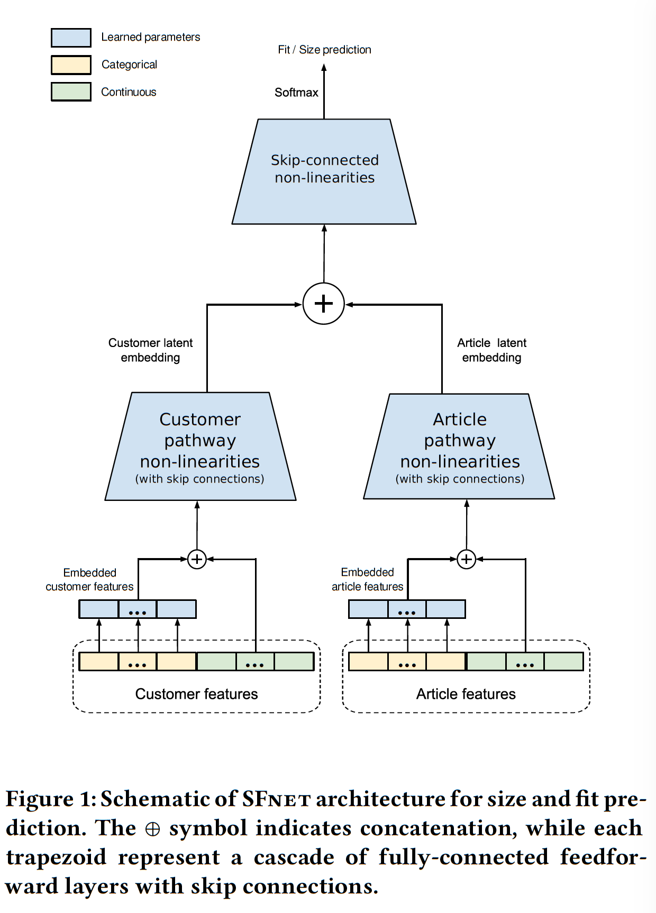

 

# A Deep Learning System for Predicting Size and Fit in Fashion E-Commerce

An (even more unofficial) PyTorch implementation of SizeFitNet (SFNet) architecture based on (unofficial) implementation of HareeshBahuleyan proposed in the paper [A Deep Learning System for Predicting Size and Fit in Fashion E-Commerce](https://arxiv.org/pdf/1907.09844.pdf) by Sheikh et. al (RecSys'19).

## Dataset
The original paper demonstrates experiments on two datasets:

1. ModCloth
2. RentTheRunWay

Both datasets are curated from fashion e-commerce websites that provide transaction information that contain `customer` attributes, `article` attributes and `fit` (target varible). `fit` is a categorical variable with `small`, `fit` and `large` as the possible labels. Only ModCloth dataset is going to be used.

## Model Architecture

The model consits of two pathways: one that captures user embeddings + user features, the other that captures item embeddings + item features. See the following figure taken from paper:

<br>

<br>

The representations within each pathway is transformed using skip connections. The authors compare it against an MLP (without skip connections) baseline and show better performance. 

Different from the paper, HareeshBahuleyan combines the user representation (u) and item representation (v) into a new tensor as below:
```
   [u, v, |u-v|, u*v]
```
- concatenation of the two representations
- element-wise product u ∗ v
- absolute element-wise difference |u-v|

Based on: https://arxiv.org/pdf/1705.02364.pdf

This new representation is fed to the top layer skip connection block.

## Instructions

1. Start by installing the necessary packages (preferably within a Python virtual environment):
```
   pip install -r requirements.txt
```

2. Download the data from [here](https://www.kaggle.com/rmisra/clothing-fit-dataset-for-size-recommendation) and place it in the `data/` directory.

3. The original data is quite messy with quite a bit of missing values (NaNs). It is required to go through the `data_preparation.ipynb` notebook to create the working data. The notebook also provides instruction on creating the train/validation/test splits. 

4. Set data, model and training configurations by appropriately modifying the `jsonnet` files under `configs/` directory. If You don't know what hyperparameters to choose, let the script do it for You, just run the optune.py script using the following command:
```
   python optune.py
```
5. Train the SFNet Model:
```
   python train.py
```
The model checkpoints and run configuration will be saved under `runs/<experiment_name>`
The above also generates tensorboard plots of training loss and validation metrics, that would be useful to view training progress.

6. Test the Model:
```
   python test.py --model `runs/<experiment_name>`
```

## Acknowledgements
Thanks to Rishab Mishra for making the datasets used here publicly available on [Kaggle](https://www.kaggle.com/rmisra/clothing-fit-dataset-for-size-recommendation). The main skeleton structure and the training process of the model is highly inspired by [HareeshBahuleyan](https://github.com/HareeshBahuleyan/size-fit-net)
